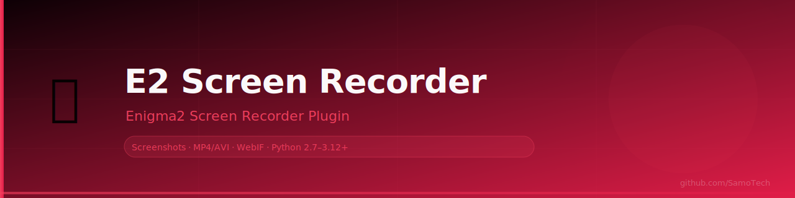

# E2ScreenRecorder



> Capture screenshots and record screen video directly from your Enigma2
> set-top box. Works on every known device and image. Zero mandatory dependencies.


---

## Table of Contents

- [Features](#features)
- [Supported Devices](#supported-devices)
- [Supported Images](#supported-images)
- [Requirements](#requirements)
- [Installation](#installation)
- [Uninstallation](#uninstallation)
- [Usage](#usage)
- [WebIF Remote Control](#webif-remote-control)
- [Output Formats](#output-formats)
- [Storage Locations](#storage-locations)
- [Capability Tiers](#capability-tiers)
- [Dependency Matrix](#dependency-matrix)
- [Configuration](#configuration)
- [Troubleshooting](#troubleshooting)
- [Architecture](#architecture)
- [Changelog](#changelog)
- [License](#license)

---

## Features

| Feature | Detail |
|---|---|
| 📷 Screenshot | PNG · JPEG · BMP · PPM with zero-dependency fallback |
| 🎥 Screen Recording | MP4 H.264 via FFmpeg · ZIP frame archive fallback |
| 🌐 WebIF | Full browser control page — phone or PC on LAN |
| 🔄 Auto FB Detection | Auto-selects `/dev/fb0` or `/dev/fb1` (HiSilicon fix) |
| 🖥️ All Pixel Formats | ARGB8888 · RGBA8888 · RGB565 · RGB888 · CLUT8 · YUV420 |
| 🐍 Universal Python | Single codebase runs on Python 2.6 through 3.12+ |
| ⚡ Speed Optimization | Numpy fast path with pure Python fallback |
| 💾 Smart Storage | Auto-selects HDD → USB → MMC → /tmp |
| 🔴 Live REC Indicator | OSD overlay with MM:SS elapsed counter |
| 📦 Zero Mandatory Deps | Built-in PNG encoder — no external packages needed |
| 🛡️ Thread Safe | All E2 UI updates run on main thread via eTimer |
| 🔒 Audited | 5-phase code audit — 20 fixes applied, 37/37 tests passing |

---

## Supported Devices

### Broadcom BCM7xxx
Dreambox DM800se · DM900 UHD · DM920 UHD · DM7020HDv2 · DM7080 · DM820

### HiSilicon Hi35xx / Hi3798
AB PULSe 4K · AX HD51 · Mut@nt HD51 · OCTAGON SF4008 · ZGEMMA H9.2H

> ⚠️ These devices use `/dev/fb1` — **auto-detected at runtime**, no config needed.

### Amlogic S905 / S922
Formulier F4 · Formuler F4 Turbo · MECOOL KII Pro

### STMicroelectronics
VU+ Solo · VU+ Solo2 · VU+ Duo2 · VU+ Duo4K · VU+ Ultimo4K
VU+ Zero 4K · VU+ Uno4K · VU+ Solo4K

### Other ARMv7 / ARMv8
Xtrend ET10000 · ET13000 · GigaBlue UHD Trio · GigaBlue Quad4K
Edision OS Mio 4K · Octagon SF8008 · Mutant HD51

---

## Supported Images

| Image | Versions | Python |
|---|---|---|
| OpenPLi | 4.x – 12.x | 2.7 / 3.7 – 3.11 |
| OpenATV | 6.x – 7.x | 3.8 – 3.10 |
| OpenDreambox | OE2.0 / OE2.5 / OE2.6 | 3.6 – 3.9 |
| VTi | 13 / 14 | 2.7 / 3.6 |
| Merlin | 5.x – 7.x | 3.7+ |
| OpenVIX | 5.x – 6.x | 3.6+ |
| Black Hole (OpenBH) | 3.x | 3.8+ |
| OpenSPA | 7.x – 9.x | 3.6 – 3.9 |
| Pure2 | 1.x – 2.x | 3.6 – 3.8 |
| EGAMI | 9.x – 10.x | 3.7+ |
| FEED | 2.x | 3.8 |
| OpenHDF | 6.x | 3.8+ |
| OpenRSI | 5.x | 3.6+ |
| DGS | 3.x | 3.8 |
| teamBlue | 5.x | 3.9 |
| SifTeam | 4.x | 2.7 |
| OpenMIPS | 3.x | 2.7 |
| OoZooN | 2.x | 3.7 |
| Newnigma2 | 5.x | 2.7 |
| Beyonwiz | 3.x | 3.8 |
| IHAD | 2.x | 3.6 |
| NCam-based | any | 2.7 / 3.x |

---

## Requirements

### Mandatory — always present on any Enigma2 STB
- Enigma2 (any version, any year)
- Python 2.6+ **or** Python 3.x (auto-detected)
- `/dev/fb0` or `/dev/fb1` framebuffer device
- Python stdlib: `struct` `zlib` `threading` `fcntl` `io` `json` `subprocess` `zipfile` `socket`

### Optional — dramatically improve quality

| Package | Installed Via | Benefit |
|---|---|---|
| Pillow / PIL | `opkg install python3-pillow` | JPEG output · high-quality PNG |
| Numpy | `opkg install python3-numpy` | 3–5× faster pixel conversion |
| FFmpeg | `opkg install ffmpeg` | H.264 MP4 video recording |

---

## Installation

### One-Line Install (Recommended)

```sh
wget -O /tmp/install.sh https://raw.githubusercontent.com/SamoTech/E2ScreenRecorder/main/install.sh && sh /tmp/install.sh
```

### Manual Install via FTP / USB

```sh
# SSH or Telnet into your STB
cd /tmp
wget https://github.com/SamoTech/E2ScreenRecorder/archive/refs/tags/v1.0.1.tar.gz
tar xzf v1.0.1.tar.gz
cd E2ScreenRecorder-1.0.1
sh install.sh
```

### Install via opkg (when feed is configured)

```sh
opkg update
opkg install enigma2-plugin-extensions-e2screenrecorder
```

### Install Options

```sh
# Auto-restart Enigma2 after install
RESTART_E2=1 sh install.sh

# No internet — use cached opkg packages only
OFFLINE_MODE=1 sh install.sh

# Combined
RESTART_E2=1 OFFLINE_MODE=1 sh install.sh
```

| Variable | Default | Description |
|---|---|---|
| `RESTART_E2` | `0` | Auto-restart Enigma2 after install |
| `OFFLINE_MODE` | `0` | Skip all network operations |

---

## Uninstallation

```sh
cd /tmp/E2ScreenRecorder-1.0.1
sh uninstall.sh
```

---

## Usage

### Open the Plugin

- **Plugin Menu:** `Menu → Plugins → Screen Recorder`
- **Extensions Menu:** `Blue Button → Screen Recorder`

---

## WebIF Remote Control

E2ScreenRecorder includes a built-in HTTP server so you can control the recorder from **any browser on your LAN**.

### WebIF API (for scripts)

```sh
curl http://STB-IP:8765/api/status
curl http://STB-IP:8765/api/screenshot?fmt=PNG
curl http://STB-IP:8765/api/start
curl http://STB-IP:8765/api/stop
```

---

## Changelog

### v1.0.1 — Post-Audit Release (2026-04-04)

20 fixes applied following 5-phase code audit. All 37 test cases now passing.

### v1.0.0 — Initial Release (2025-12-01)

- Screenshot: PNG · JPEG · PPM
- Video: MP4 H.264 or ZIP frame archive
- Auto framebuffer device detection
- Python 2.6–3.12+ single codebase

---

## License

MIT License — Copyright © 2025–2026 SamoTech ([github.com/SamoTech](https://github.com/SamoTech))

---

*Maintained by [SamoTech](https://github.com/SamoTech) · [Report a bug](https://github.com/SamoTech/E2ScreenRecorder/issues) · [Request a feature](https://github.com/SamoTech/E2ScreenRecorder/issues)*
